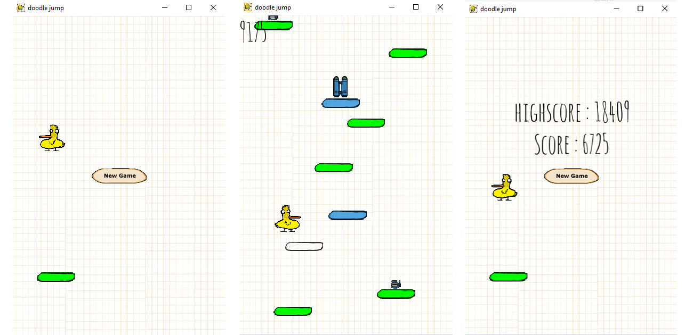

# AP_doodle_game

## About The Project
This is my doodle project for the class advanced programming.   

This year’s project consists of designing and implementing an interactive game, inspired by Doodle Jump, in
C++.   for our visualisation we are using the SFML graphics library.

## Gameplay

This game is an endless platformer game. The object of the game is to get the highest score possible by making the 
jumping player move from platform to platform. You can achieve this by using the q and d buttons (on an azerty keyboard)
or the arrow keys to move the player from side to side.

## Documenation

- [Doxygen documentation (index.html)](../AP_doodle_game/docs/html/index.html)
## References

- [https://en.wikipedia.org/wiki/Doodle_Jump](https://en.wikipedia.org/wiki/Doodle_Jump) 
- [https://www.sfml-dev.org/](https://www.sfml-dev.org/)
- [https://www.doxygen.nl/manual/docblocks.html](https://www.doxygen.nl/manual/docblocks.html)

## Author 
**Elias Dams**

- [github Profile](https://github.com/Elias-Dams "Elias-Dams"): Elias-Dams
- Email: elias.dams@student.uantwerpen.be
